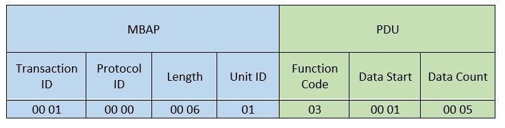

# ModbusRAW

This protocol is **build upon model a request and replay model**! It uses *function codes* in combination with data section to request/send data!  

Modbus function codes and their description:

| Function| Description								                |
| ------- | --------------------------------------	  |
| FC=01		| Read Coil Status							            |
| FC=02		| Read Input Status							            |
| FC=03   | Read multiple holding registers           |
| FC=04   | Read Input Registers                      |
| FC=05   | Write Single Coil                         |
| FC=06   | Write Single Holding Register             |
| FC=07   | Read Exception Status                     |
| FC=08   | Diagnostics                               |
| FC=11   | Get Comm Event Counter **(RTU)**          |
| FC=12   | Get Comm Event Log **(RTU)**              |
| FC=14   | **Read Device Identification**            |
| FC=15   | Write multiple coils                      |
| FC=17   | Write multiple holding registers          |
| FC=20   | Read file record                          |
| FC=21   | Write file record                         |
| FC=22   | Mask Write Register                       |
| FC=23   | Read/Write Multiple Registers             |
| FC=24   | Read FIFO Queue                           |
| FC=43   | **Read Device Identification**            |
| FC=90   | Implement new function                    |

Function codes are used to build modbus packet which is going to be send over TCP/IP. The modbus packet have the following format:



Shodan dork: *port:502*

Output example:

```
/../cmake-build-debug/Modbus_RAW
-------------
Request RAW: 00 01 00 00 00 06 01 01 00 01 00 0F 

Transaction ID: 00 01
Protocol ID   : 00 00
Length        : 00 06
Unit ID       : 01

Function code : 01
Start address : 00 01
Data count    : 00 0F

-------------
Response RAW: 00 01 00 00 00 05 01 01 02 FF 7F 

Transaction ID: 00 01
Protocol ID   : 00 00
Length        : 00 05
Unit ID       : 01
Function code : 01
Data count    : 02 bytes


Process finished with exit code 0
```
Security perspective of modbus: https://github.com/caffedrine/Tools/tree/master/Pentest/Industrial/Modbus
